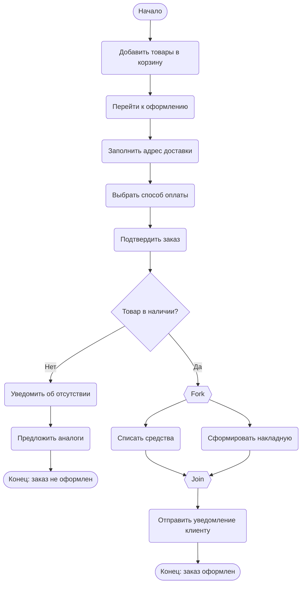

# Практическая работа №15
## Диаграмма деятельности: Оформление заказа в интернет-магазине

**Студент:** Мамиев И.А.  
**Группа:** ПИЖ-б-о-25-2(2)

---

## Описание процесса

Процесс оформления заказа в интернет-магазине включает следующие основные этапы:

1. Пользователь выбирает товары и добавляет их в корзину
2. Переходит к оформлению заказа
3. Заполняет адрес доставки
4. Выбирает способ оплаты
5. Подтверждает заказ
6. Система проверяет наличие товаров
7. **Параллельно:** происходит списание средств и формирование накладной
8. Отправка уведомления клиенту
9. Завершение процесса

---

## Диаграмма деятельности

Пояснения к диаграмме
Ключевые шаги:
| Шаг	| Действие | Описание |
|-------|----------|----------|
1 |	Добавление товаров |	Пользователь выбирает товары в каталоге
2 |	Заполнение адреса | Указывается город, улица, дом, квартира
3 |	Выбор оплаты |	Карта, наличные при получении, онлайн-кошелёк
4 |	Проверка наличия |	Система сверяет остатки на складе

## Узлы решения (ветвления):  
  * Проверка наличия товара — если товар отсутствует, клиенту предлагаются аналоги; если есть — процесс продолжается

## Параллельные ветви (fork/join):  
После подтверждения наличия товара система одновременно:

  1. Списывает средства с выбранного способа оплаты
  2. Формирует накладную для службы доставки

Оба действия должны завершиться, прежде чем будет отправлено уведомление клиенту.

## Конечные узлы:
  * [Конец: заказ не оформлен] — при отсутствии товара  
  *[Конец: заказ оформлен] — при успешном завершении  

---

# Контрольные вопросы к практической работе №15
## Диаграмма деятельности (Activity Diagram)

### 1. Что такое диаграмма деятельности и для чего она используется?

**Ответ:** Диаграмма деятельности — вид UML-диаграмм для моделирования динамики системы. Используется для визуализации алгоритмов, бизнес-процессов, выявления параллельных потоков.

### 2. Чем диаграмма деятельности отличается от блок-схемы?

**Ответ:** Диаграмма деятельности поддерживает параллельные потоки (fork/join) и синхронизацию, тогда как блок-схема — только последовательные алгоритмы.

### 3. Как обозначается начальный узел в Mermaid?

**Ответ:** `([*])` или `Start([Начало])`.

### 4. Как обозначается узел решения (ветвление)?

**Ответ:** Ромб: `id{Текст вопроса}`.

### 5. Как в Mermaid реализовать параллельные ветви (fork/join)?

**Ответ:** Созданием узла-разделителя с несколькими исходящими стрелками и узла-соединителя с несколькими входящими.

### 6. Зачем нужны узлы слияния (merge) и соединители (join)?

**Ответ:** Merge — для слияния альтернативных потоков; Join — для синхронизации параллельных (ждёт все ветки).

### 7. Какие правила именования действий вы знаете?

**Ответ:** Использовать глаголы, краткость, начинать с действия, избегать технических деталей.

### 8. Можно ли на одной диаграмме деятельности иметь несколько конечных узлов?

**Ответ:** Да, для отображения разных вариантов завершения процесса.

