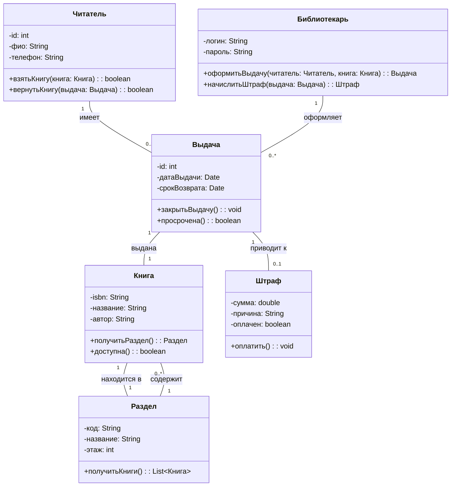

# Диаграмма классов: Библиотечная система

## Описание предметной области

Система предназначена для автоматизации работы библиотеки. Читатель может искать книги, брать их на абонемент и возвращать. Библиотекарь оформляет выдачу и возврат, начисляет штрафы за просрочку. Книги находятся в определённых разделах библиотеки. Каждая выдача фиксируется в виде транзакции.

### Основные классы:
- **Читатель** – пользователь библиотеки.
- **Книга** – единица хранения.
- **Раздел** – местонахождение книги.
- **Выдача** – факт выдачи книги читателю.
- **Штраф** – начисление за просрочку.
- **Библиотекарь** – сотрудник, управляющий выдачей.

## Диаграмма классов (Mermaid)



## Пояснения к отношениям

| Отношение |	Тип | Объяснение |
|-----------|-------|------------|
Читатель → Выдача	| Ассоциация (1..*)	| Один читатель может иметь много выдач.
Книга → Раздел	| Агрегация (1..1)	| Книга находится в одном разделе, раздел может существовать без книги.
Выдача → Книга	| Композиция (1..1)	| Выдача не может существовать без книги (жёсткая связь).
Выдача → Штраф	| Ассоциация (1..0..1)	| Не каждая выдача приводит к штрафу.
Библиотекарь → Выдача	| Ассоциация (1..*)	| Библиотекарь оформляет много выдач.
Раздел → Книга	| Агрегация (1..*)	| Раздел содержит много книг, книги могут переходить в другой раздел.

---

## Контрольные вопросы
### 1. Что такое диаграмма классов и для чего она используется? 

    Диаграмма классов — это основной вид диаграмм статической структуры в UML. Она используется для визуализации классов системы, их атрибутов, методов и связей между ними. Помогает в проектировании архитектуры и генерации кода.

### 2. Какие три основные секции имеет прямоугольник класса?

    * Имя класса
    * Атрибуты
    * Методы (операции)

### 3. Что означают символы ‘+’, ‘-’, ‘#’ перед атрибутами и методами?

    "+" — public (открытый)

    "-" — private (закрытый)

    "#" — protected (защищённый)

### 4. Как в Mermaid обозначается наследование?  
    ```md
    ChildClass --|> ParentClass
    ```

### 5. В чём разница между агрегацией и композицией?

    * Агрегация (o--): часть может существовать без целого (например, игрок без команды).

    * Композиция (*--): часть не может существовать без целого (например, комната без дома).

### 6. Как указать множественность отношения (например, «один ко многим»)?
"1" -- "1..*" у соответствующих концов связи.

### 7. Как изобразить интерфейс в Mermaid?

```md
class InterfaceName {
    <<interface>>
    +method(): void
}
```

### 8. Какую информацию можно указать в сигнатуре метода?

  * Видимость (+, -, #)
  * Имя метода
  * Параметры (имя и тип)
  * Возвращаемый тип

